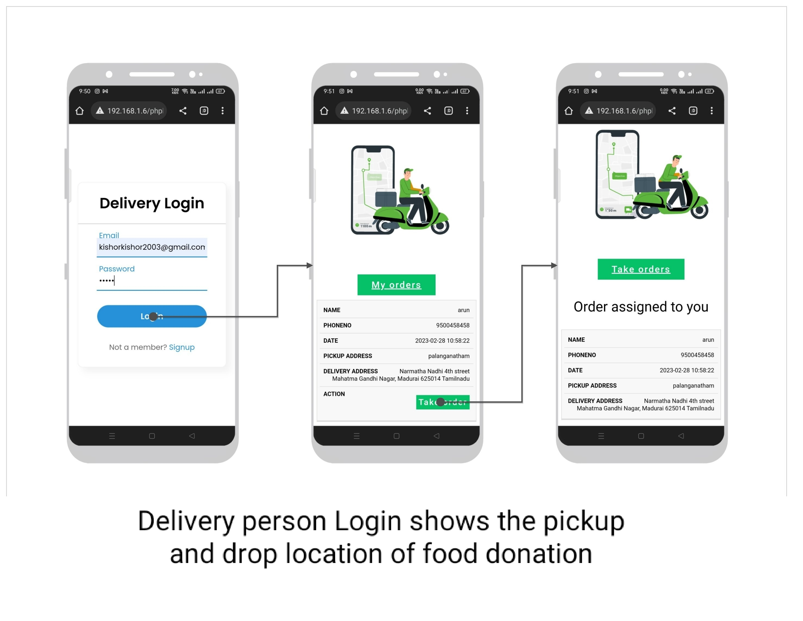
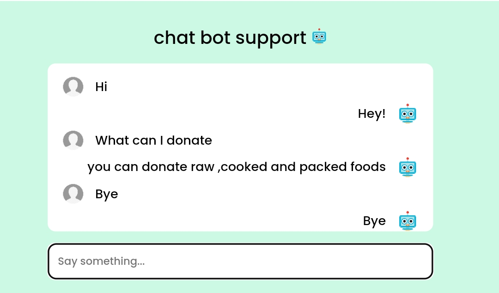

# Food Waste Management System

A **final year Computer Science project** developed to reduce food wastage and help the needy. This is a complete web-based solution that connects food donors, NGOs, and delivery personnel to ensure timely collection and distribution of excess food.

---

## 🔧 Tech Stack

- **Frontend**: HTML, CSS, JavaScript  
- **Backend**: PHP  
- **Database**: MySQL  
- **Styling**: Custom CSS  
- **Chatbot**: JavaScript-based chatbot  

---

## 🚀 Features

- 🥘 **Food Donation Form** – Donors can register surplus food  
- 👥 **Role-Based Login** – Separate dashboards for:
  - Donor  
  - Admin  
  - Delivery Personnel  
- 🚚 **Delivery Management** – Admin can assign delivery members  
- 📈 **Admin Dashboard** – View total donations and trends  
- 💬 **Chatbot Support** – Quick assistance via chatbot  
- 🔐 **Authentication** – Secure login/signup with session handling  
- 📍 **Location Input** – Region and sub-area based delivery handling  

---

## 📸 Demo Screenshots

### 🌐 Home Page

### 🙍‍♂️ User Side
**Signup**  
  
**Login**  
  
**Profile**  
  
**Donation Form**  
  
**Donation Placed**  
  

### 👨‍💼 Admin Side
**Signup**  
  
**Login**  
  
**Dashboard**  
  
**Analytics**  
  
  

### 🚚 Delivery Person
**Signup**  
  
**Login**  
  
**Orders**  
  
  
  
**Location View**  
  

### 💬 Chatbot

### 📬 Feedback

### 📞 Contact & About

### 🧩 System Overview

### ❗ Unassigned Donations

---

## Modules

### 👤 User Module

### 👨‍💼 Admin Module

### 🚚 Delivery Module

### 🔧 Additional Features
- Mobile Screen Friendly Website  
- Chatbot Support  
- Secure Login System  

### 📱 Mobile Responsive

### 💬 Chatbot Support

### 🔐 Secure Login System

---

## 🧪 How to Run the Project

1. Download the project zip file  
2. Extract the file and copy the folder  
3. Paste it inside your server's root directory:  
   - For **XAMPP**: `htdocs/`  
   - For **WAMP**: `www/`  
   - For **LAMP**: `/var/www/html/`  
4. Open [http://localhost/phpmyadmin](http://localhost/phpmyadmin)  
5. Create a new database (e.g., `fwm_db`)  
6. Import the `demo.sql` file inside the `database/` folder  
7. Run the project in browser:  
   `http://localhost/your-folder-name`

---

## ⚠️ Notes

- Built for academic/demo purposes  
- PHP 7.x or above recommended  
- Compatible with modern browsers like Chrome or Firefox  
- Ensure Apache & MySQL services are running before use  

---

## ✍️ Developer

> **Deepa Savita**  
> Final Year B.Sc. Computer Science  
> Passionate about solving real-world problems through code 💻  
> 🌟 *Let’s feed the hungry by reducing food waste.*

  

