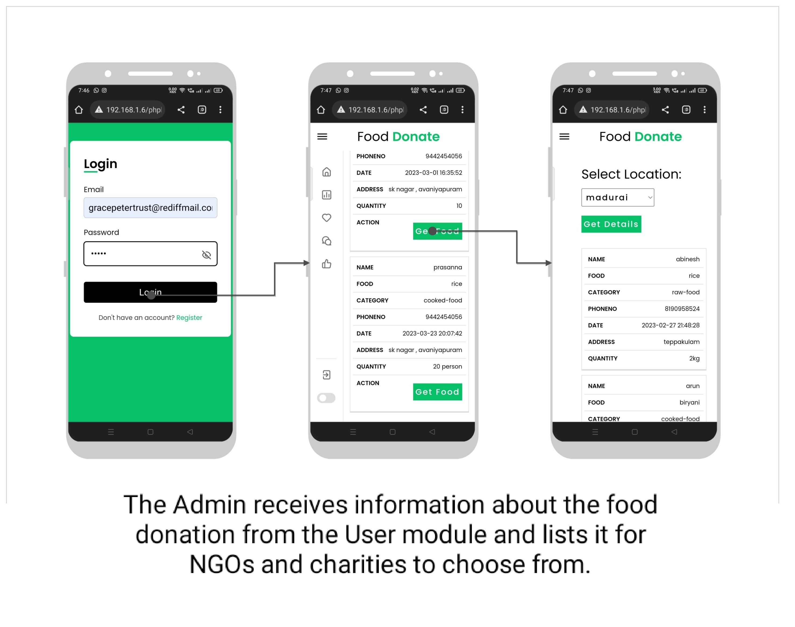

# Food Waste Management System

A **final year Computer Science project** developed to reduce food wastage and help the needy. This is a complete web-based solution that connects food donors, NGOs, and delivery personnel to ensure timely collection and distribution of excess food.

---

## 🔧 Tech Stack

- **Frontend**: HTML, CSS, JavaScript
- **Backend**: PHP
- **Database**: MySQL
- **Styling**: Custom CSS
- **Chatbot**: JavaScript-based chatbot

---

## 🚀 Features

- 🥘 **Food Donation Form** – Donors can register surplus food
- 👥 **Role-Based Login** – Separate dashboards for:
  - Donor
    - Admin
      - Delivery Personnel
      - 🚚 **Delivery Management** – Admin can assign delivery members
      - 📈 **Admin Dashboard** – View total donations and trends
      - 💬 **Chatbot Support** – Quick assistance via chatbot
      - 🔐 **Authentication** – Secure login/signup with session handling
      - 📍 **Location Input** – Region and sub-area based delivery handling

      ---
      
---

## 📸 Demo Screenshots

<h2>🌐 Home Page</h2>

<h2>🙍‍♂️ User Side</h2>
<h3>Signup</h3>

<h3>Login</h3>

<h3>Profile</h3>

<h3>Donation Form</h3>

<h3>Donation Placed</h3>

<h2>👨‍💼 Admin Side</h2>
<h3>Signup</h3>

<h3>Login</h3>

<h3>Dashboard</h3>

<h3>Analytics</h3>

<h2>🚚 Delivery Person</h2>
<h3>Signup</h3>

<h3>Login</h3>

<h3>Orders</h3>

<h3>Location View</h3>

<h2>💬 Chatbot</h2>

<h2>📬 Feedback</h2>

<h2>📞 Contact & About</h2>

<h2>🧩 System Overview</h2>

<h2>❗ Unassigned Donations</h2>

    <h3>User </h3>
   <!--  -->
    
    <h3>Admin </h3>
    
     <h3>Delivery </h3>
    
    <h3>features:</h3>
    <ul><li>Mobile Screen friendly website.</li>
      <li>chatbot support</li>
      <li>Secure Login</li>
      </ul>
      <h2>Mobile Screen friendly website.</h2>
      
      <h2>chatbot support</h2>
      
      <h2>Secure Login</h2>
      
      <h2>How to run</h2>
      <ol>
       <li>Download the project zip file</li>
       <li> Extract the file and copy the folder</li>
       <li>Paste inside root directory(for xampp xampp/htdocs, for wamp wamp/www, for lamp var/www/Html)</li>
       <li> Open PHPMyAdmin (http://localhost/phpmyadmin)</li>
       <li> Create a database</li>
       <li>Import demo.sql file(inside database folder)</li>
       <li> Run the script http://localhost/folderName </li> </ol>

## 🧪 How to Run the Project

1. Install [XAMPP](https://www.apachefriends.org/) or any PHP local server
2. Copy the project folder to: `C:\xampp\htdocs\`
3. Start **Apache** and **MySQL** from XAMPP Control Panel
4. Open your browser and go to:  
   `http://localhost/phpmyadmin`
5. Create a new database (e.g., `fwm_db`) and **import** `database/demo.sql`
6. Access the system via:  
   `http://localhost/food-waste-management-system/index.html`

---

## ⚠️ Notes

- Built for academic/demo purposes  
- PHP 7.x or above recommended  
- Compatible with modern browsers like Chrome or Firefox  
- Ensure Apache & MySQL services are running before use  

---

## ✍️ Developer

> **Deepa Savita**  
> Final Year B.Sc. Computer Science  
> Passionate about solving real-world problems through code 💻  
> 🌟 *Let’s feed the hungry by reducing food waste.*

  

